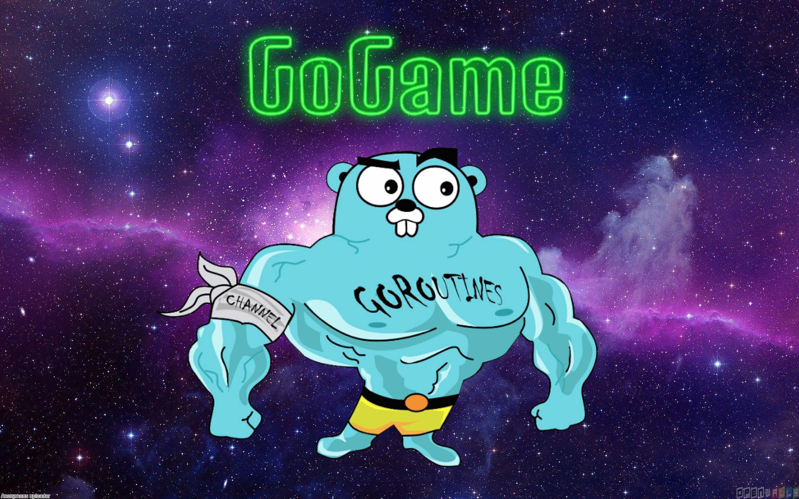

# GoGame



## About

A repository dedicated towards learning GoLang Syntax by making simple terminal based game. The idea is to apply concepts learned from Go By Example into a the game instead of just copying the examples and trying to learn from them. Below is a checklist of concepts that have been used in the game. 

## Build

```bash
go run main.go
go build
```

## Checklist

- [x] Hello World
- [x] Values
- [x] Variables
- [x] Constants
- [x] For
- [x] If/Else
- [x] Switch
- [x] Arrays
- [ ] Slices
- [ ] Maps
- [ ] Range
- [x] Functions
- [ ] Multiple Return Values
- [ ] Variadic Functions
- [ ] Closures
- [ ] Recursion
- [X] Pointers
- [x] Structs
- [ ] Methods
- [ ] Interfaces
- [ ] Errors
- [ ] Goroutines
- [ ] Channels
- [ ] Channel Buffering
- [ ] Channel Synchronization
- [ ] Channel Directions
- [ ] Select
- [ ] Timeouts
- [ ] Non-Blocking Channel Operations
- [ ] Closing Channels
- [ ] Range over Channels
- [ ] Timers
- [ ] Tickers
- [ ] Worker Pools
- [ ] WaitGroups
- [ ] Rate Limiting
- [ ] Atomic Counters
- [ ] Mutexes
- [ ] Stateful Goroutines
- [ ] Sorting
- [ ] Sorting by Functions
- [ ] Panic
- [ ] Defer
- [ ] Collection Functions
- [ ] String Functions
- [x] String Formatting
- [ ] Regular Expressions
- [ ] JSON
- [ ] XML
- [ ] Time
- [ ] Epoch
- [ ] Time Formatting / Parsing
- [X] Random Numbers
- [ ] Number Parsing
- [ ] URL Parsing
- [X] SHA1 Hashes
- [ ] Base64 Encoding
- [ ] Reading Files
- [ ] Writing Files
- [ ] Line Filters
- [ ] File Paths
- [ ] Directories
- [ ] Temporary Files and Directories
- [ ] Testing
- [ ] Command-Line Arguments
- [ ] Command-Line Flags
- [ ] Command-Line Subcommands
- [ ] Environment Variables
- [ ] HTTP Clients
- [ ] HTTP Servers
- [ ] Context
- [ ] Spawning Processes
- [ ] Exec'ing Processes
- [ ] Signals
- [X] Exit

## Resources
[Go By Example](https://gobyexample.com/) 
[Writing Go Packages](https://golang.org/doc/code.html#ImportingLocal)


